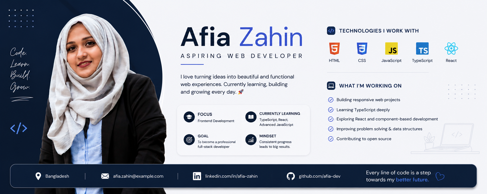

  

<h2 align="center">Open to Collaboration 🤝</h2>

  

---

## 👋 About Me

I'm a **Marketing graduate** who started learning programming as an extra skill and unexpectedly discovered a genuine passion for web development.

I'm currently focused on building my frontend development skills, creating real-world projects, and continuously learning new technologies.

-  Currently working on **building and improving my frontend development skills.**

- Learning **JavaScript, TypeScript, React, Tailwind CSS, and modern frontend development.**

- Eager to collaborate on **exciting web projects, open-source projects, and creative frontend applications.**

-  I’m looking for help with **improving my JavaScript, TypeScript, and React skills, building real-world projects, and learning best practices in web development.**

- Reach me at- **afia.zahin06@gmail.com**

- Know about my experiences **[View My Resume](https://drive.google.com/file/d/1N2q3_Itl8wRw4Px3FSqDA6yFUQrPj-2c/view?usp=sharing)**

- Fun fact: **I’m a Marketing graduate who thought programming would just be an extra skill... turns out, I may have accidentally found a new passion. 💻✨**

---

## 🚀 Currently Learning

- JavaScript
- TypeScript
- React
- Tailwind CSS
- Responsive Web Development
- Problem Solving & Data Structures

---

## 💻 Currently Working On

- Building responsive web projects
- Improving my JavaScript skills
- Learning TypeScript
- Exploring React and component-based development
- Building projects for my portfolio

---

## 🤝 Looking to Collaborate

I'm looking to collaborate on:

- Beginner-friendly web development projects
- Open-source projects
- Frontend applications
- Creative and meaningful web experiences

I'm always happy to learn from other developers and build something useful together. 🚀

---

## 🔗 Connect With Me

  

---

## 🛠️ Languages and Tools

  

  

  

  

  

  

---

## 📊 GitHub Stats

  

  

  

---

  <b>💙 Learning, building, and growing one line of code at a time.</b>

